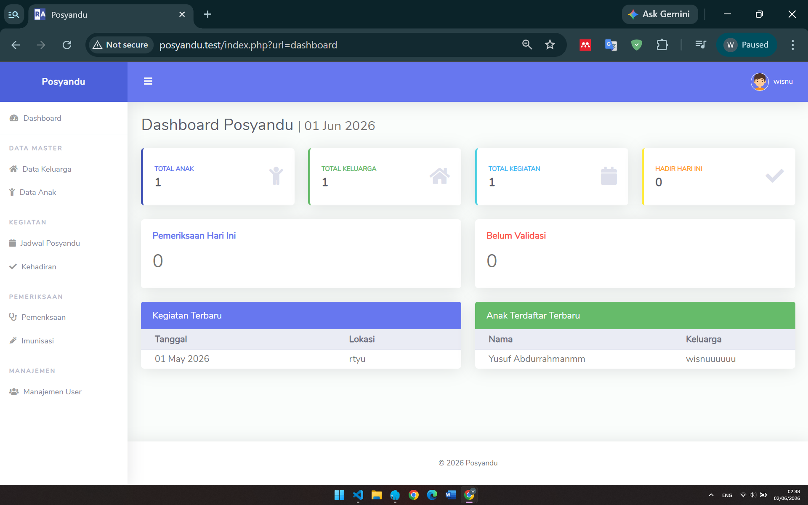

# Posyandu System

Sistem Informasi Posyandu berbasis PHP Native dan MariaDB untuk membantu pengelolaan data keluarga, data anak, kegiatan posyandu, pemeriksaan kesehatan, imunisasi, serta manajemen pengguna.

## Preview



## Fitur

### Dashboard
- Statistik total anak
- Statistik total keluarga
- Statistik total kegiatan
- Statistik kehadiran hari ini
- Monitoring pemeriksaan
- Monitoring validasi data
- Daftar kegiatan terbaru
- Daftar anak terbaru

### Data Master
- Manajemen Data Keluarga
- Manajemen Data Anak
- Detail data keluarga
- Detail data anak
- Upload foto anak

### Kegiatan Posyandu
- Jadwal kegiatan posyandu
- Kehadiran anak
- Riwayat kegiatan

### Pemeriksaan
- Pencatatan berat badan
- Pencatatan tinggi badan
- Pencatatan lingkar kepala
- Status gizi
- Catatan pemeriksaan
- Validasi pemeriksaan oleh bidan

### Imunisasi
- Pencatatan imunisasi
- Riwayat imunisasi anak
- Petugas pemberi imunisasi

### Manajemen User
- Login sistem
- Role Admin
- Role Kader
- Role Bidan
- Pengelolaan akun pengguna

---

## Teknologi

- PHP Native
- MariaDB / MySQL
- Bootstrap
- jQuery
- Font Awesome
- Laragon

---

## Struktur Database

### Tabel Utama

- `users`
- `keluarga`
- `anak`
- `kegiatan`
- `kehadiran`
- `pemeriksaan`
- `imunisasi`

---

## Struktur Folder

```text
posyandu/
│
├── config/
├── modules/
│   ├── dashboard/
│   ├── keluarga/
│   ├── anak/
│   ├── kegiatan/
│   ├── kehadiran/
│   ├── pemeriksaan/
│   ├── imunisasi/
│   └── users/
│
├── views/
├── assets/
├── auth/
└── index.php
```

---

## Role Pengguna

### Admin
- Mengelola seluruh data
- Mengelola user
- Mengakses seluruh menu

### Kader
- Mengelola data keluarga
- Mengelola data anak
- Mengelola kegiatan
- Mengelola kehadiran
- Mengelola pemeriksaan
- Mengelola imunisasi

### Bidan
- Mengakses data kesehatan
- Memvalidasi pemeriksaan
- Mengelola imunisasi

---

## Screenshot

### Dashboard


---

## Informasi Database

File database (.sql) tidak disertakan langsung dalam repository.

Jika diperlukan, silakan menghubungi pengembang untuk mendapatkan file database.

## Lisensi
Project ini dibuat untuk kebutuhan pembelajaran, penelitian, dan pengembangan Sistem Informasi Posyandu.